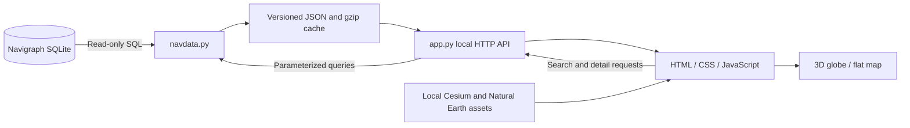

# Programme 01: design and AI handover

Created: 2 October 2026, Hong Kong time. This is the implemented first programme in the user's two-programme research project.

## 1. User intent and scope

The user requested Python development in VS Code, under:

```text
<local project directory>
```

The first programme should provide an Earth-like HTML visualiser with 3D and flat modes, camera movement, and all waypoint connections. The user explicitly requested detailed Markdown that another AI can follow.

The delivered interpretation of “connections” is **every en-route segment recorded in the Navigraph database's `airway` table**, joined to its actual waypoint IDs. We do not connect every possible pair of points, infer nearest-neighbour links, or assume that a geographically plausible line is an airway.

Programme 02 has not been specified. There are flight CSV files in the project, but the existence of those files is not a specification for traffic reconstruction or matching. Ask for that programme's purpose when the user starts it.

## 2. Input evidence

The source examined was `../Navigraph/little_navmap_navigraph.sqlite`, 281,456,640 bytes. Its own metadata reported:

| Field | Observed value |
| --- | --- |
| `data_source` | NAVIGRAPH |
| `airac_cycle` | 2610 |
| `db_version_major`, `db_version_minor` | 14, 29 |
| `last_load_timestamp` | 2026-09-27T12:25:56.982 |
| `valid_through` | `0110291026` — retained as the raw source string |
| `has_sid_star` | 1 |

The programme does not parse or certify the raw validity string. It displays the AIRAC cycle, and preserves the original metadata for follow-up work.

The initial audit and export found:

| Item | Count |
| --- | ---: |
| Waypoint rows | 257,277 |
| Airway segment rows | 91,099 |
| Distinct waypoints referenced by airway endpoints | 47,317 |
| Waypoints not referenced by an en-route segment | 209,960 |
| Distinct airway names | 9,859 |
| J / high segments | 29,461 |
| V / low segments | 30,775 |
| B / high and low segments | 30,863 |
| N / no one-way restriction | 68,070 |
| F / forward-only segments | 14,567 |
| B / backward-only segments | 8,462 |
| Segments crossing the ±180° longitude boundary | 97 |
| Missing endpoint references | 0 |
| Invalid coordinate records excluded from the export | 0 |

`airway_type=B` and `direction=B` are entirely different fields: the first means both altitude classes; the second means backward. Never mix those interpretations.

The sibling `navrecord.dat` was inspected only enough to identify that it is a separate navigation-data input. It is not parsed by Programme 01. Prefer the relational SQLite source because its explicit endpoint references remove guesswork.

The sibling `flight/` folder contains three CX3294/CX3295 CSV recordings with columns `Timestamp,UTC,Callsign,Position,Altitude,Speed,Direction`. These files are not loaded by the viewer.

## 3. Important data semantics

### Stable identity inside a dataset

`waypoint_id` is the graph node key. The textual `ident` is a display/search label, not a unique key. A name can occur in several regions and at several coordinates. Search therefore returns separate records containing ID, region, and coordinates.

Database IDs should be treated as cycle-local: replacing the database may change them. Do not persist long-term selections using only an ID across AIRAC updates.

### Recorded edges and fragments

Each `airway` row is an independently preserved segment. Its endpoints are `from_waypoint_id` and `to_waypoint_id`. Each segment also has its own endpoint coordinates; these are preserved and used for rendering rather than recalculated from a name lookup.

The row preserves `airway_id`, airway name, class, route type, direction, minimum/maximum altitude, `airway_fragment_no`, and `sequence_no`. Multiple rows may share the same endpoints. Those may be different airways or classes; they are not deduplicated.

An airway name can be reused in disconnected fragments and geographical areas. The viewer highlights all rows with a selected name and sorts their details by fragment and sequence. It never creates a segment between separate fragments.

### Direction

According to the upstream Little Navmap/atools schema, N means no directional restriction in this field, F means forward, and B means backward. Forward runs from the stored `from` endpoint to `to`; backward reverses that order.

The global network is drawn as thin coloured lines for legibility and performance. Selected one-way links use arrow materials. N links use a plain gold line and a two-way indicator in the details. The viewer does not model time-dependent restrictions, aircraft performance, clearances, or operational route validation.

### Coordinates and altitude

Coordinates are longitude/latitude in degrees, on Cesium's WGS84 ellipsoid. Points and endpoints must be finite and within [-180,180] longitude and [-90,90] latitude. Bad points, missing references, or invalid edge endpoints are excluded from the exported network and counted explicitly in its manifest.

Database minimum/maximum airway altitudes are kept as raw integers. Details format them in feet; null and the common 99999 sentinel are shown as unspecified. No vertical route constraints are inferred.

**Display heights are artificial rendering offsets.** Lines are drawn 4,500 metres above the ellipsoid, ordinary point dots at 5,000 metres, and selected overlays at 6,500–8,000 metres. These values prevent depth fighting and are unrelated to real airway altitude. The first programme visualises horizontal network topology.

### Unlinked points and completeness

“Unlinked” means not referenced by this dataset's `airway` table. It does not mean the point is useless, invalid, or has no procedure role. SID/STAR/approach tables are present in the database, but not interpreted by this version.

The network export always includes all valid waypoint and airway rows. The default dot layer displays only the 47,317 airway-connected waypoints. The optional all-points layer displays every valid waypoint. Hiding dots or hiding an airway class changes the visual layer, not the underlying dataset.

Published connectivity is not measured air traffic. The programme does not claim that every shown link is currently flown, or that line density represents traffic intensity. This distinction is also stated in the UI.

## 4. Architecture



### Python responsibilities

- `navdata.py` validates and exports the graph, keeps cache metadata, and performs read-only search/detail queries.
- `app.py` serves static assets, compressed network data, search, and details through `ThreadingHTTPServer`.
- Only Python standard-library modules are required at runtime.
- Each search/detail request opens and closes its own SQLite connection; connections are not shared between HTTP threads.
- All source connections use SQLite URI `mode=ro` plus `PRAGMA query_only=ON`.
- The connection helper supports paths containing spaces and Windows mapped-drive/UNC paths. Be careful replacing its URI construction: `Path.resolve().as_uri()` can introduce a UNC authority rejected by SQLite.

### Browser responsibilities

- The HTML provides controls, search results, detail panels, loading progress, and status counts.
- CesiumJS renders the ellipsoid, local imagery, GPU network lines, waypoint dots, and selection overlays.
- Plain JavaScript controls mode changes, camera motion, layer visibility, selection, and search debounce.
- No React, npm build, web framework, cloud service, or Cesium ion token is needed to run the delivered programme.

## 5. Files and ownership

```text
project root/
  Navigraph.code-workspace             Root VS Code workspace and run/debug tasks
  PROJECT_OVERVIEW.md                  Two-programme status and entry point
  Navigraph/                          Existing inputs, not modified
  flight/                             Existing recordings, not modified
  programme_01_waypoint_visualiser/
    app.py                            HTTP server and CLI
    navdata.py                        SQLite adapter and exporter
    README.md                         Operating instructions
    DESIGN_AND_HANDOVER.md            This engineering handover
    requirements.txt                  Explains zero pip runtime dependencies
    .vscode/                          Run/debug configs for opening this folder alone
    web/
      index.html                      Viewer UI
      style.css                       Responsive layout and visual theme
      app.js                          All viewer behaviour and GPU construction
      vendor/cesium/                   Installed third-party runtime/assets/licence
    tools/
      setup_assets.py                 Pinned, SHA-512 verified Cesium download
      browser_smoke.cjs                Optional Playwright integration QA
    cache/
      manifest.json                   Source signature, columns, metadata, counts
      network.json                    Compact full graph export
      network.json.gz                 Compressed graph response
    tests/
      test_navdata.py                  17 standard-library regression tests
      artifacts/                      Screenshots and browser-report.json
    logs/                             Logs from the initial background preview server
```

Cache, logs, browser artifacts, Python bytecode, and installed vendor assets are ignored by the programme's `.gitignore`. They are present locally for immediate use. A future Git checkout must restore vendor assets with `python tools/setup_assets.py`; cache regenerates on launch.

## 6. Export and cache contract

The exporter orders records by their numeric IDs and writes a JSON document with `format_version=1`, `manifest`, `waypoints`, and `segments`. Record arrays keep the download substantially smaller than repeated JSON field names.

Waypoint array positions:

```text
[id, ident, region, longitude, latitude, type]
```

Segment array positions:

```text
[id, from_id, to_id, name, type, direction,
 minimum_altitude, maximum_altitude, fragment, sequence,
 from_longitude, from_latitude, to_longitude, to_latitude, route_type]
```

The manifest also declares `waypoint_columns` and `segment_columns`. `web/app.js` uses these positions directly. A schema change must update both readers and writers and increment `FORMAT_VERSION`.

The initial export is 24,551,729 bytes of JSON and 6,832,769 bytes of gzip. HTTP gzip negotiation reduces transfer while preserving every record. The observed first export took about two seconds on this computer; performance will depend on storage and hardware.

Cache reuse requires matching absolute source path, byte size, modification time in nanoseconds, and exporter format version. Missing output files also trigger a rebuild. Each file is written to a temporary sibling and replaced atomically; the manifest is written last.

Limitations: this is a file-stat signature, not a complete content hash. Changes that preserve both size and timestamp need `--rebuild`. Cached JSON is trusted if its manifest matches; manual cache corruption needs a forced rebuild. Do not run two simultaneous rebuilds into the same cache directory. Separate database sessions in the same programme directory also share the cache location; run one source at a time.

The running server holds network bytes in memory. If the source is replaced while it is running, detail queries could read a different cycle than the already-loaded graph. Stop/restart the server and reload the browser whenever changing the database.

## 7. HTTP API contract

Default bind address: `127.0.0.1:8765`. This is a local research application, with no authentication or production deployment configuration.

| Method and path | Result |
| --- | --- |
| GET `/` | Main HTML page |
| GET `/api/health` | Programme identity and `ok=true` |
| GET `/api/manifest` | Source metadata, counts, columns, and signature |
| GET `/api/network` | Entire exported graph; gzip when accepted |
| GET `/api/search?q=BEKOL` | Up to 20 matching waypoints and 20 matching airway names |
| GET `/api/waypoint/53637` | Full waypoint row plus incident airway rows joined to endpoint labels |
| GET `/api/airway/A1` | All rows for the exact airway name, sorted by fragment/sequence |
| GET `/vendor/cesium/...` | Local rendering library, workers, styles, imagery |

Search is uppercase, literal, prefix matching. Exact matches sort first. `%`, `_`, and backslash are escaped for SQL LIKE; values are bound as parameters. Empty search returns empty lists. Query text is limited to 50 characters. IDs are parsed as integers. Missing records return 404; invalid IDs return 400.

The full graph endpoint supplies an ETag and accepts `If-None-Match` with 304 responses. Static responses are sent with `nosniff`; `.js` is explicitly served with a JavaScript MIME type for Windows compatibility. Static file paths are resolved and checked to stay inside the `web` directory. Source SQLite, CSVs, cache, and documentation are not static web roots.

Some API results intentionally return the complete original database row. Another AI may add typed response models later, but must not silently drop route semantics used by the UI.

## 8. Rendering decisions and tradeoffs

### CesiumJS and local imagery

CesiumJS provides the same world coordinates in 3D and 2D, camera controls, ellipsoid-aware interpolation, date-line handling, and object picking. It is pinned at 1.146.0. `tools/setup_assets.py` downloads the npm tarball, checks a fixed SHA-512 integrity value, and extracts only the built runtime/assets plus licensing metadata using containment checks.

The imagery is the Natural Earth II tiles included in Cesium's build. Maximum tile level is 2. This makes the delivered map immediately usable offline, but gives coarse imagery at close zoom. No terrain relief, street labels, detailed political boundaries, or online tiles are added. The Cesium credit display is retained.

### Global airway batches

Creating 91,099 independent Cesium entities would impose unnecessary per-object overhead. Instead, `makeNetworkLines()` builds one GPU primitive per airway class. Each primitive is a custom indexed `LINES` geometry with double-precision world positions and one class colour.

Each segment follows a WGS84 ellipsoid geodesic. It is sampled at no more than approximately 100 km between vertices. Individual Cartesian line chords remain above the ellipsoid using the artificial display height. Cesium's geometry pipeline projects positions for flat mode and splits lines at the antimeridian. Global primitive picking is disabled: selecting a fix or searching an airway uses a separate detail/highlight path.

The initial image shows a dense global network; that density is expected from the full database. The brightness slider and independent airway class switches make it easier to inspect regions.

### Point primitives

`makePoints()` builds `PointPrimitiveCollection` batches of at most 8,000 dots, yielding periodically to keep the page responsive. Each dot carries `{kind:'waypoint', id}` for picking. Connected dots and unlinked dots have different colours and sizes. Pixel size scales with distance to reduce global clutter.

Changing the all-points option builds replacement collections hidden, then swaps them in. A generation counter cancels stale point builds. The all-points toggle is disabled during a build. This is a deliberate performance compromise: all records are accessible, while the common initial view uses fewer dots.

### Highlight overlays and asynchronous UI

Selected links use a small Cesium entity overlay, allowing wider gold lines and arrows. Waypoint selection labels its chosen fix and shows all incident segment records. Airway selection displays all matching segments, and limits the detail list to 250 rows when necessary; the whole airway is still highlighted.

Search requests are debounced by 230 ms. Search and selection generation counters reject out-of-order responses. DOM content from database values is assigned through `textContent` and text nodes rather than injected as HTML.

Rendering uses `requestRenderMode` to reduce idle GPU work. Camera and layer changes request rendering. Slow rotation uses elapsed time and requests frames while active. Flat-mode switches stop auto rotation. Resolution scaling limits rendering cost on very high-density screens.

`window.NavigraphAtlas` exposes viewer state and a few methods only for local QA and continuation. It is not a stable external API.

## 9. Verification performed

### Automated Python tests

Run from the programme directory:

```powershell
python -m unittest discover -s tests -v
```

All 17 tests passed on 2 October 2026. They use a miniature SQLite fixture rather than altering the supplied database. Cases cover duplicate labels, separate fragments, forward/backward direction preservation, dateline coordinates, invalid coordinates, missing references, unlinked fixes, denied writes, gzip equivalence, source-change cache invalidation, cache reuse, missing-cache recovery, literal wildcard/injection input, incident joins, HTTP encoding quality values, ETags, invalid/missing IDs, and traversal rejection.

Windows-specific lesson: SQLite's connection context manager commits/rolls back but does not close a connection. The adapter and test fixtures use `contextlib.closing` explicitly. Retain that behaviour to avoid Windows file locks during temporary fixture cleanup.

### Actual dataset browser tests

`tools/browser_smoke.cjs` was run against the complete supplied dataset in headless Microsoft Edge, using Playwright and software WebGL. Its passing `tests/artifacts/browser-report.json` records approximately 22 seconds for the interaction suite after final viewer changes.

It checked 3D initialisation, all 91,099 segments, 47,317 default dots, region movement, BEKOL search and details, A1 highlighting, switching to flat mode and back, layer visibility/counts, brightness, all 257,277 dots, camera buttons, and auto rotation. It observed zero page/console errors and zero external HTTP requests. Local blob worker URLs are counted as local resources.

The following saved screenshots were visually inspected for globe rendering, overlays, and flat-map layout:

- `tests/artifacts/01-globe.png`
- `tests/artifacts/02-east-asia.png`
- `tests/artifacts/03-waypoint.png`
- `tests/artifacts/04-flat-map.png`

This suite currently asserts counts for the supplied cycle. If future source data changes, update those count expectations or compare them to a freshly audited manifest. The script requires a server at the default port and an installed Edge browser. Playwright is optional development tooling, not needed by the programme.

A failed screenshot may remain in `tests/artifacts/failure.png` from an earlier QA attempt; the authoritative result is the final passing `browser-report.json`. Earlier QA issues were test harness classification of local blob URLs and waiting for the actual scene mode instead of a fixed delay. They were corrected before the final pass.

## 10. Deliberate limits

1. Completeness is measured against the supplied `waypoint` and `airway` tables, not every possible real-world connection. SID/STAR/approach relationships, dynamic oceanic tracks, direct clearances, and free-route choices are not added.
2. No traffic-volume analysis, historical utilisation, live aircraft, or map matching is implemented.
3. Global lines cannot be picked individually. A waypoint click or airway search exposes segment details and directions.
4. The map has no labels for every dot. Labels appear for selected fixes to avoid thousands of overlapping names.
5. Airway highlighting uses a shared name across all fragments, so a reused name may produce a broad view. A region/fragment selector is a possible improvement.
6. All-point mode uses more browser memory and startup work. Large future datasets may benefit from spatial streaming and level-of-detail filtering.
7. Natural Earth imagery is intentionally low resolution; the globe has no terrain mesh relief.
8. The server is a local standard-library research server, not a hardened public deployment.
9. Source updates require stopping and restarting the server. There is no hot reload of the database.
10. The background preview created during initial development is not an installed Windows service or startup task.

## 11. How another AI should continue

First read this document, the README, `navdata.py`, and `web/app.js`. Confirm the user's next requested behaviour before assigning a purpose to Programme 02.

Preserve these invariants:

- Read the original navigation data without editing it.
- Use numeric waypoint IDs for identity inside a cycle, and retain regions/coordinates for display.
- Preserve endpoint IDs, direction, route type, altitude values, fragment numbers, and sequence.
- Never invent a connection from proximity alone without explicitly labelling a separate inferred layer.
- Keep published connectivity and measured/inferred traffic as separate data products.
- Keep all currently supported rows available, and clearly report filtering/exclusions.
- Update the export version when its array layout or interpretation changes.
- Recheck both 3D and flat modes after geometry changes, including date-line crossings.

Suggested extension points, only when requested:

| Requested capability | Place to start | Important concern |
| --- | --- | --- |
| Actual flight-track overlay | Separate parser for `flight/*.csv`; independent browser layer | Parse quoted Position into latitude/longitude; preserve time, callsign, altitude, and units. |
| Track-to-airway matching | A new analysis module/programme, sharing the read-only adapter | Nearest fix alone is insufficient; handle direction, noise, missing samples, and route alternatives. |
| Traffic intensity colouring | Separate observations/aggregation table and visual layer | Connectivity density must not be relabelled as observed traffic. |
| Terminal procedures | New adapter for approach/transition and leg tables | Interpret leg types and discontinuities; do not join arbitrary procedure rows. |
| Region/fragment selection | `NavData.airway()` response + detail UI | Airway names are not globally unique route identities. |
| Route graph algorithms | Directed adjacency built from exported segment IDs | N adds both traversal directions, F forward, B backward; retain parallel edges and constraints. |
| Larger datasets | Worker geometry construction, typed binary export, spatial tiles | Retain identity and source fidelity while changing transport/rendering. |
| Better imagery | An explicit optional imagery setting | State external network/token requirements; keep the offline option. |
| Save research views | Separate user configuration file | Cycle-aware waypoint references and camera/mode/layer persistence. |

For Python changes, run the 17 regression tests. For front-end changes, run `node --check web/app.js` and the browser suite; inspect new screenshots. Broaden verification when the change introduces new semantics rather than repeating tests without a reason.

## 12. Primary references used during implementation

- [Little Navmap files documentation](https://www.littlenavmap.org/manuals/littlenavmap/release/latest/en/FILES.html): identifies the Navigraph SQLite database and schema resources.
- [atools navigation schema](https://github.com/albar965/atools/blob/master/resources/sql/fs/db/create_nav_schema.sql): documents airway class, direction, endpoint references, and disconnected fragments.
- [Cesium PerInstanceColorAppearance](https://cesium.com/learn/cesiumjs/ref-doc/PerInstanceColorAppearance.html): position-only flat-colour primitive requirements.
- [Cesium TileMapServiceImageryProvider](https://cesium.com/learn/cesiumjs/ref-doc/TileMapServiceImageryProvider.html): local TMS imagery loading.
- [Cesium imagery guide](https://cesium.com/learn/cesiumjs-learn/cesiumjs-imagery/): imagery-provider setup and browser texture-access requirements.
- [CesiumJS source](https://github.com/CesiumGS/cesium): upstream implementation and licence context.

The input database is the authority for this project's recorded graph. External documentation informs schema interpretation and rendering APIs; it does not replace local source evidence.
